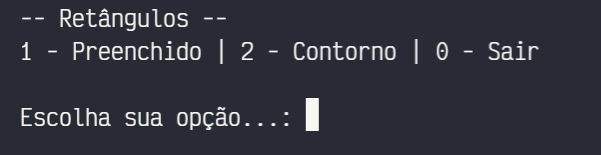
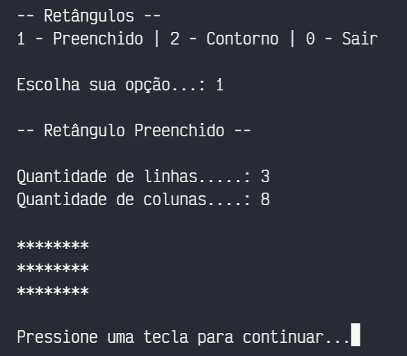
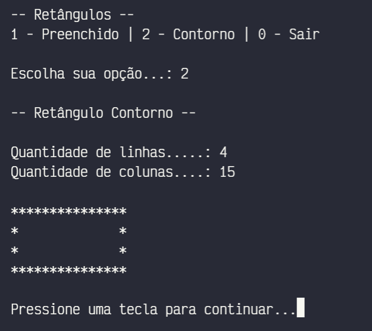

# Retângulos

Exibe retângulos em ASCII Art.

## Funcionalidades

- Exibe um retângulo preenchido
- Exibe um retângulo somente em contorno

## _Screenshots_

Menu principal:

Retângulo preenchido:

Retângulo somente em contorno:

## Download

[🔽 Baixar o programa](dist/retangulos.zip)

## Créditos

Feito na [Etec Adolpho Berezin](htpp://eteab.com.br).
